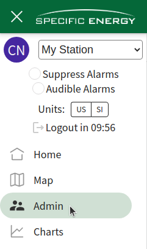
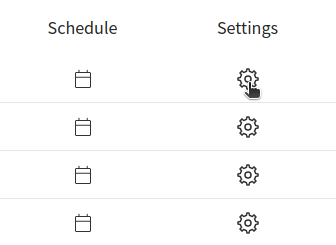
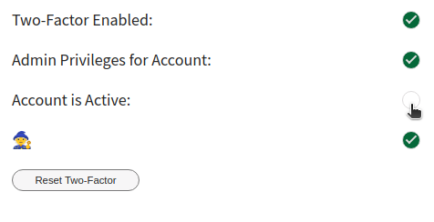

# How do I remove access for a user?

### Admins may change within Settings menu: 

1. Navigate to the **System Settings**  

2. Click the settings (cog) icon next to the user  

3. Deselect the **Account is Active** checkbox  

**Only admins may change if the account is active*